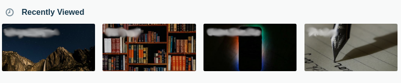

# Hide the **Recently Viewed** Section from the Trello Website.

This extension hides the entire section shown above from the Trello website. This section is not usually used and makes the boards page look unorganised.

Download and click on the [trello-extension.crx](https://github.com/abhishekbalam/trello-hide-recent-boards/raw/master/build/trello-extension.crx) file to install in your browser.